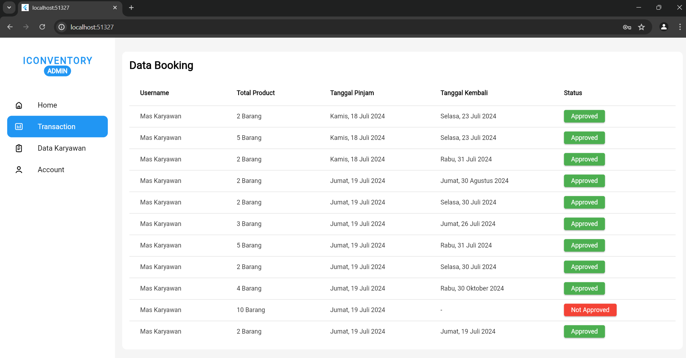
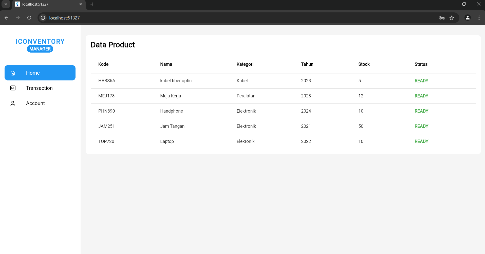

# Iconventory Web

## Techstack
- Firebase
- Bloc State Management

## Roles
- Admin
- Manager
- Employee

### ADMIN

**Responsibilities:**
- Create products
- Approve item borrow requests

### MANAGER

**Responsibilities:**
- View dashboard

### EMPLOYEE

**Responsibilities:**
- Process item borrow transactions
